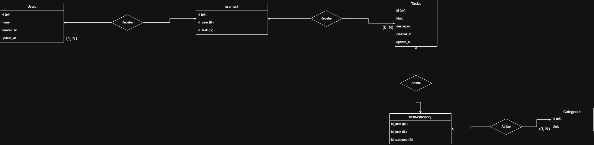

 Descrição do sistema: 

Será desenvolvido um sistema de gerenciador de tarefas integrado com o banco de dados. Onde será possível atribuir uma tarefa a um usuário e esta receberá uma ou várias categorias, exemplo: João --> Varrer o chão da sala --> 40 minutos.
